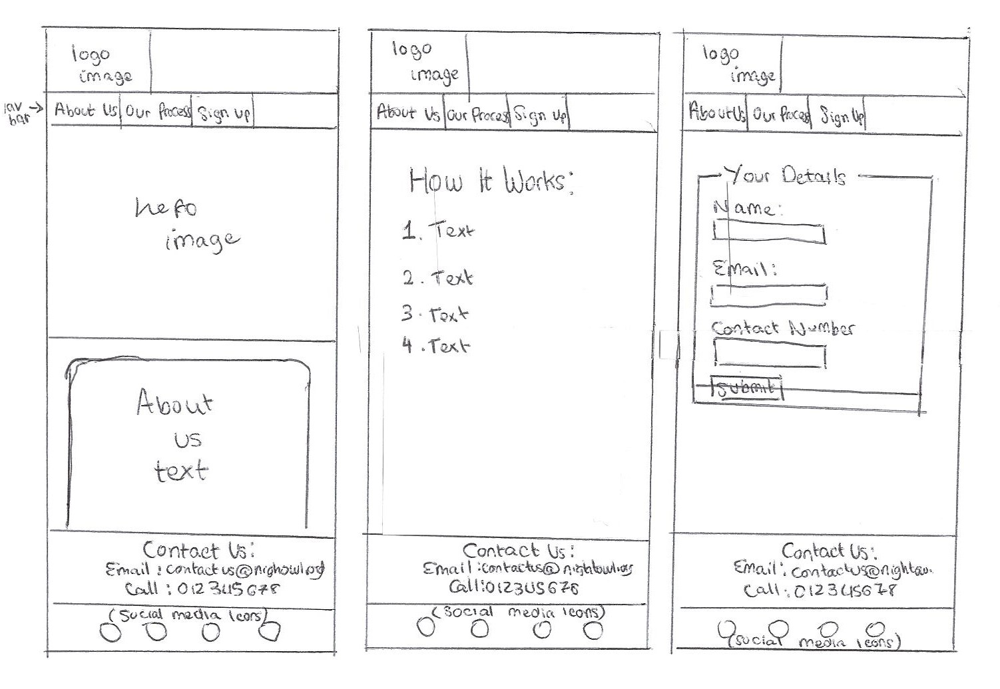

# Night Owl

Night Owl is a site that informs pregnant mothers about a free service available to them. The site will be targeted toward pregnant mothers with other children at home, who need a babysitter for their other children when they go to the hospital to give birth. Night owl will be useful for mothers to find out about the service, and to sign up.

{width=50%}

{width=50%}

{width=50%}

## Wireframes

{width=50%}

{width=50%}

{width=50%}

## Features

### About Us

- The landing page includes a photograph with text alongside it explaining what the organisation does and the location this website is applicable to.
- This introduces the user to Night owl with a magical image that draws them in, alogside an explanation of why this site would be useful to them.

### Our Process

- This page explains to the user how to sign up for the service and breaks the process down into simple steps to make it clear and concise and ensures the user understand what they are signing up for. 
- It also includes a hyperlink to direct the user to the Signup page to help with easy navigation.

### Sign Up

- This page includes a clear form for the user to submit their personal details to sign up for the service.

### Form Confirmation

- This page informs the user that they have submitted their details and includes a hyperlink back to the landing page.

## Existing Features

### Navigation Bar

- Featured on all three pages as well as the form confirmation page. 
- The fully responsive navigation bar includes links to the About Us landing page, Our Process page, and Sign Up page and is identical in each page to allow for easy navigation.
- This will allow the user to easily navigate from page to page across all devices without having to revert back to the previous page via the ‘back’ button.
- The navigation bar also indicates which page you are on by changing the text color.

### Footer

- Featured on all three pages as well as the form confirmation page. 
- The footer includes includes links to the relevant social media sites for Night Owl as well as contact information. The links will open to a new tab to allow easy navigation for the user. 
- The footer is valuable to the user as it encourages them to keep connected via social media or contact the organisation should they have any questions.

## Features Left to Implement:
- Volunteer sign up page.
- An option to leave a comment or ask a question.

## Testing

- I tested that this page works in different browsers: chrome, microsoft edge, and firefox.
- I confirmed that this project is responsive, looks good, and functions on all standars screen sizes using the devtools device toolbar.
- I confirmed that the Header, nav bar, About Us, Our Process, Sign Up, Form Confirmation and footer text are all readable and easy to understand.
- I confirmed that the form works; every field is required, it will only acccept an email in the email field and the submit button works.
- The landing page of my project responds to different screen sizes by displaying the image above the text on smalller screens, and alongside the text on larger screens.
- The footer displays the contact information accross one line on larger screens, and two lines on smaller screens.

### Bugs

#### Solved Bugs

- When I deployed my project, I discovered that the links to the images did not work. 
- I discovered that this was because I used absolute file paths such as this in my code.
   src="/assets/images/pexels-selin-hacıkerimoğlu-18099553.jpg"
- removing the starting / solved the problem.

## Validator Testing

### HTML
- No errors were returned when passing through the official W3C validator

### CSS

- No errors were found when passing through the official (Jigsaw) validator

### Accesibility

- I confirmed that the fonts and colors chosen for the text are easy to read and accessible by running my code through the lighthouse in Devtools.

## Deployment

The site was deployed to GitHub pages. The steps to deploy are as follows:
1. In the GitHub repository, navigate to the Settings tab
2. From the source section drop-down menu, select the Master Branch
3. Once the master branch has been selected, the page will be automatically refreshed with a detailed ribbon display to indicate the successful deployment.
4. The live link can be found here - https://rochilaz123.github.io/Peronal-Project1/

## Credits

### Content

- The code for the social media links was taken from [Love Running](https://github.com/Code-Institute-Solutions/love-running-2.0-sourcecode/blob/main/08-responsive-elements/05-responsive-gallery/index.html).

### Media

- The image on the landing page was taken from [Pexels](https://www.pexels.com/photo/newborn-asleep-in-a-wooden-basket-18099549/).

